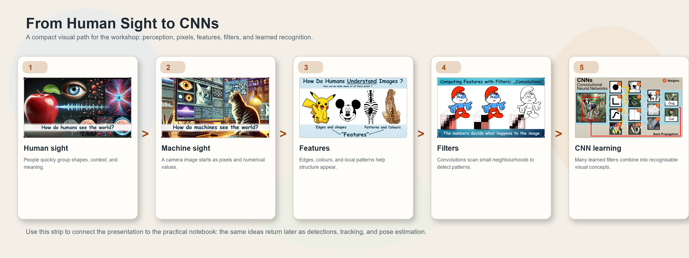

# Kinderuniversity
## How Do Machines See and Learn?

Built through repeated Kinderuniversiteit workshops in Belgium, this repository turns computer vision into something learners can see, test, discuss, and extend for themselves. The material aims to build understanding in Neural Networks and Computer Vision and support teachers get a clear structure, students with a fun starting point for coding.

For teachers, this is an easy starting point for introducing computer vision with slides, live webcam experiments, a game, and a closing quiz. For students, it is also a project base: they can add new detection targets, new levels, new maps, new dialogue, or even new training ideas of their own.

<p align="center">
  
</p>

<p align="center">
  <a href="docs/media/final-level-pose-estimation.mp4">Watch the final pose-estimation level</a>
  |
  <a href="1_Presentation/Kinderuniversiteit%20Presentation%20-%20EN.pptx">Open the English presentation</a>
  |
  <a href="2_Practical%20Exercise/251024_Final_VisualizingComputerVisionPipeline.ipynb">Open the practical notebook</a>
  |
  <a href="3_Game/251025_CVgame_treasure-hunt.ipynb">Open the game notebook</a>
</p>

## Why This Works Well In Class

- It follows a real teaching arc: first explain, then visualize, then let students apply the ideas in a game.
- It treats AI as something to inspect and question, not a black box to admire from a distance.
- It gives live feedback through the webcam, which makes the workshop social and memorable.
- It has already been refined in front of real Kinderuniversiteit groups in Belgium.
- It leaves room for genuine follow-up work instead of ending with a fixed demo.

## From Human Sight To CNNs

<p align="center">
  
</p>

The workshop first builds intuition about perception, then shows how images become pixels and features, and only then introduces convolutional neural networks. That same path returns later in the practical notebook and in the game.

## How We Usually Give This Workshop

### 1. Start With The Basics

We begin with the slides in `1_Presentation/`. This is where we introduce the central question: how do humans see, how do machines see, and how can a neural network learn meaningful patterns from images?

<p align="center">
  
</p>

### 2. Revisit The Same Steps Live

Next, we open `2_Practical Exercise/251024_Final_VisualizingComputerVisionPipeline.ipynb`. Here, the same ideas return as webcam-based visualizations, filters, detections, tracking, and pose estimation. This is the bridge between theory and application.

### 3. Turn Understanding Into Play

Then we run `3_Game/251025_CVgame_treasure-hunt.ipynb`. The early levels use object detection. The later levels use pose estimation. Students stop being spectators and start using the technology actively.

### 4. Finish On The Quiz

We return to the questions from the presentation and use the quiz to connect the playful part back to the vocabulary and ideas from the first half of the workshop.

### 5. If There Is Time: Train A Small Model Live

As an optional extension, we run `2_Practical Exercise/TrainNetwork_updated_v2.py`. This script trains a small custom single-object detector from scratch and visualizes what it is looking for while it learns. We begin with a small set of positive examples, then continue with live feedback: correct detections are reinforced with more target examples, while wrong guesses are corrected with background examples. In workshop terms, this becomes a concrete way to discuss training data, feedback, and why models only improve when the examples are meaningful.

<p align="center">
  
</p>

## Before You Present

- The notebooks and the optional training script now start with a package check. If something is missing, they print a friendly install command and explain what to do next.
- The first time you run the practical notebook or the game, Ultralytics may download model weights automatically. Before presenting, it is strongly recommended to run the material once in advance and step through every level so downloads, caching, and warm-up happen before the audience arrives.
- The optional background-mask capture cell is placed after the main game cell. Most workshops do not need it. If you do want to hide part of the webcam view, capture the mask, paint the forbidden area red, and then run the game again.

## Installation

Python 3.10 or newer is a good starting point on Windows. A webcam is required for the practical notebook and the game.

Create and activate an environment:

```bash
python -m venv .venv
.venv\Scripts\activate
python -m pip install --upgrade pip
```

Install the main packages:

```bash
python -m pip install notebook numpy opencv-python pygame torch ultralytics
```

Notes:

- `tkinter` is used by the practical notebook and is included with most standard Windows Python installations.
- If you want GPU acceleration, install the matching PyTorch build for your system before running the workshop.
- The runtime checks inside the notebooks and script will tell you what is missing if your environment is incomplete.

## Running The Workshop Materials

### Presentation

Open one of the slide decks in `1_Presentation/`.

- `Kinderuniversiteit Presentation - EN.pptx`
- `Kinderuniversiteit Presentation - NL.pptx`

### Practical Exercise

```bash
cd "2_Practical Exercise"
jupyter notebook 251024_Final_VisualizingComputerVisionPipeline.ipynb
```

### Game

```bash
cd "3_Game"
jupyter notebook 251025_CVgame_treasure-hunt.ipynb
```

### Optional Live Training Demo

```bash
cd "2_Practical Exercise"
python TrainNetwork_updated_v2.py
```

## Practical Exercise: Short Guide For Teachers

This notebook works best as a guided comparison: the same short recording is replayed through increasingly more powerful ways of "seeing". The explanations below are intentionally simplified for adult readers without a computer-vision background.

1. **RGB numbers vs pixels**  
   The image is simplified into larger blocks, and each block shows an average RGB value. This helps explain that a digital image is built from color values rather than objects.  
   Ask: See how the first value is highest in red regions? Which values do you notice in dark areas? Which values become high in very bright white regions?

2. **Convolution sweep**  
   A small window moves across the image and updates the center region using information from nearby pixels. The main idea is that computers often look at small neighborhoods, not one pixel in isolation.  
   Ask: Why might the center pixel be easier to interpret if we also look at its neighbors?

3. **Edges**  
   This keeps mainly the places where brightness changes strongly, such as outlines or boundaries. Flat regions often disappear while structure remains.  
   Ask: Which parts vanish completely, and which edges stay visible?

4. **Color quantization**  
   The image is reduced to a smaller set of representative colors. Fine shading is lost, but the main shapes are still recognizable.  
   Ask: What detail is lost here, and what is still surprisingly easy to identify?

5. **Edges plus quantization**  
   This combines simplified colors with strong boundaries. It is a useful step for showing how several processing ideas can be layered.  
   Ask: Does the image become easier to read with both simplification and edges together?

6. **Template matching**  
   The notebook slides a small example image over the full frame and looks for places that resemble it. This is simple and intuitive, but much less flexible than modern learned detectors.  
   Ask: What would happen if the object changes size, angle, or is partly hidden?

7. **YOLO-World detection**  
   Now the notebook uses a pretrained detector that can place boxes around objects and assign labels. This is a good moment to contrast hand-made matching with learned recognition.  
   Ask: Which detections look reliable, and which ones seem surprising or wrong?

8. **Person tracking**  
   The system tries to keep the same identity for a detected person over time. This adds the idea of continuity, not just single-frame detection.  
   Ask: What gets harder when people cross each other or move quickly?

9. **Pose estimation**  
   The model predicts body keypoints such as shoulders, elbows, wrists, hips, knees, and ankles. This shows that a model can estimate structure, not just draw a box.  
   Ask: Which joints are easiest to detect, and which ones disappear when they are hidden?

10. **Left vs right people**  
    Detection results are turned into a simple rule: how many people are on the left side of the screen and how many are on the right? This is a nice example of a model feeding a simple decision.  
    Ask: What should happen if a person stands almost exactly in the middle?

11. **Live YOLO-World with `classes.txt`**  
    The final step returns to a live camera feed and uses `templates/classes.txt` to decide which objects the model should look for. This helps teachers move from "using AI" to "choosing what the system should do".  
    Ask: Which class names work well, and which ones are too vague or ambiguous?

## What Is In This Repository

- `1_Presentation/` contains the English and Dutch slide decks.
- `2_Practical Exercise/` contains the practical notebook, template images, and the optional live training script.
- `3_Game/` contains the treasure-hunt notebook, supporting Python files, maps, sounds, dialogue, and player assets.
- `docs/media/` contains the workshop photos, the workflow collage, and the short demo video used in this README.

## Good Follow-Up Tasks For Students

- Add a new object-detection level in `3_Game/CV_navigation.py`.
- Add a new pose-based level in `3_Game/CV_pose_estimation.py` and the game notebook.
- Change the object classes in `2_Practical Exercise/templates/classes.txt`.
- Translate or adapt the story in `3_Game/dialogs_*.json`.
- Create new maps, props, or interactions in `3_Game/maps/`.

## Privacy And Generated Files

The repository ignores locally generated webcam artifacts and leaderboard data such as:

- `3_Game/privacy_mask_template.png`
- `3_Game/Leaderboard/leaderboard.json`
- `3_Game/Leaderboard/ritual_success_*.png`

That keeps personal workshop data out of a normal Git workflow while still allowing the game to generate these files locally when needed.
